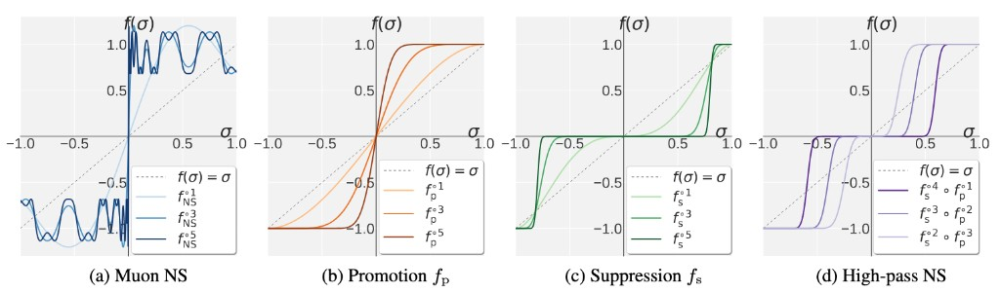

<div align='center'>

# Rethinking Muon Beyond Pretraining: Spectral Failures and High-Pass Remedies for VLA and RLVR

[](https://arxiv.org/abs/2605.19282)
[](https://chongyu-fan.netlify.app/posts/pion/)
[](https://github.com/OPTML-Group/Pion/issues)

[](https://opensource.org/licenses/MIT)
[](https://pytorch.org/)

</div>

<p align="center">
  <b>Chongyu Fan</b><sup>†</sup> &nbsp;
  Gaowen Liu<sup>‡</sup> &nbsp;
  Mingyi Hong<sup>¶</sup> &nbsp;
  Ramana Rao Kompella<sup>‡</sup> &nbsp;
  Sijia Liu<sup>†,§</sup>
</p>

<p align="center">
  <sup>†</sup>Michigan State University &nbsp;&nbsp;
  <sup>‡</sup>Cisco &nbsp;&nbsp;
  <sup>¶</sup>University of Minnesota &nbsp;&nbsp;
  <sup>§</sup>IBM Research
</p>

---

This is the official code repository for the paper [**"Rethinking Muon
Beyond Pretraining: Spectral Failures and High-Pass Remedies for VLA and
RLVR"**](https://arxiv.org/abs/2605.19282), which introduces **Pion**
(s**P**ectral h**I**gh-pass **O**ptimization on mome**N**tum) -- a
drop-in replacement for Muon designed for regimes such
as **vision-language-action** (VLA) training and **reinforcement
learning with verifiable rewards** (RLVR). See the
[project page](https://chongyu-fan.netlify.app/posts/pion/) for more.

<p align="center">
  
  <br>
  <em>Visualization of <code>f(&sigma;)</code> over
  <code>&sigma; &in; [0, 1]</code>, with <code>f(&sigma;) = &sigma;</code>
  shown as the identity reference.
  <b>(a)</b> <code>f<sup>t</sup><sub>NS</sub></code> denotes Muon's NS
  iteration applied <code>t</code> times.
  <b>(b)</b> <code>f<sup>t</sup><sub>p</sub></code> denotes the Promotion
  polynomial <code>f<sub>p</sub></code> applied <code>t</code> times.
  <b>(c)</b> <code>f<sup>t</sup><sub>s</sub></code> denotes the Suppression
  polynomial <code>f<sub>s</sub></code> applied <code>t</code> times.
  <b>(d)</b> Pion's high-pass NS iteration:
  <code>f<sup>k<sub>s</sub></sup><sub>s</sub> &compfn;
  f<sup>k<sub>p</sub></sup><sub>p</sub></code> applies
  <code>k<sub>p</sub></code> Promotion steps followed by
  <code>k<sub>s</sub> = 5 - k<sub>p</sub></code> Suppression steps.</em>
</p>

## Abstract

Muon (**M**oment**U**m **O**rthogonalized by **N**ewton–**S**chulz) is a
matrix-aware optimizer that leverages Newton–Schulz (NS) iterations to
enforce spectral gradient orthogonalization by driving all singular values
of the momentum matrix toward 1. While this *uniform spectral whitening*
enhances exploration and outperforms AdamW in LLM pretraining, we show it
could lead to fundamental limitations beyond pretraining in two increasingly
important regimes: **(i)** cross-modality *vision-language-action* (VLA)
training, where inherently low-rank action-module gradients cause
amplification of noisy tail directions, and **(ii)** *reinforcement learning
with verifiable rewards* (RLVR), where low-SNR gradients and the need to
preserve per-head specialization inherited from prior training make
whitening unstable. To address these challenges, we propose **Pion** (s**P**ectral h**I**gh-pass
**O**ptimization on mome**N**tum), a drop-in replacement for Muon that
preserves its computational efficiency while replacing uniform spectral
whitening with a two-stage *Promotion + Suppression* mechanism, which we
call the *high-pass NS* iteration. This design induces a sharp spectral
high-pass effect, anchoring dominant singular values at 1 while suppressing
noisy tail components toward 0, with controllable filter strength. To preserve pretrained per-head heterogeneity, Pion also supports a
*per-head* mode that applies updates independently across attention heads
via a simple reshape, at no extra cost. Extensive experiments demonstrate
consistent gains over Muon and AdamW across both VLA and RLVR regimes. In
VLA training on LIBERO and LIBERO-Plus, Pion consistently outperforms both
baselines across ℓ<sub>1</sub>-regression (VLA-Adapter) and flow-matching
(VLANeXt) architectures, *e.g.*, reaching **100%** success rate on LIBERO
Object at training 1,500 steps with VLA-Adapter, vs. 97.0% for Muon and
only 32.2% for AdamW. In RLVR post-training on Qwen3-1.7B/4B with GRPO and
GMPO, Pion also outperforms AdamW on MATH and GSM8K while Muon collapses to
zero.

## What's in this repo

A single self-contained file [`pion.py`](pion.py) that implements four
optimizers, all sharing the same distributed async `all_gather` skeleton:

| Optimizer        | What it does                                                                                                          |
| ---------------- | --------------------------------------------------------------------------------------------------------------------- |
| `Muon`           | The original Muon baseline (Newton–Schulz orthogonalization).                                                         |
| `DefaultPion`    | Pion with the two-stage **Promotion + Suppression** (high-pass NS) iteration applied to the whole matrix.             |
| `PerHeadPion`    | Pion applied **independently per attention head** through a reshape, preserving pretrained per-head heterogeneity.    |
| `LowRankMuon`    | Muon variant that uses exact SVD to project the update onto the top-`k` singular subspace before orthogonalization.   |


## Getting Started

### Quick start: drop-in replacement for AdamW / Muon

Like the original Muon, Pion optimizers should be applied **only to 2D
weight matrices** (and 4D conv filters). Embedding layers, the LM head,
layer-norms and any 0/1-D parameters should be routed to AdamW.

```python
import torch
from Pion import DefaultPion, PerHeadPion

muon_params, adam_params = [], []
for name, p in model.named_parameters():
    if p.ndim >= 2 and "embed" not in name and "lm_head" not in name:
        muon_params.append(p)
    else:
        adam_params.append(p)

# Single-GPU
optimizer = DefaultPion(
    muon_params,
    lr=1e-5,
    promotion_steps=0,
    scale_factor=2.0,
    rank=0, world_size=1,
)
adamw = torch.optim.AdamW(adam_params, lr=1e-5)
```

Defaults are `promotion_steps=0`, `ns_steps=5` (pure-Suppression /
high-pass), and `scale_factor=2.0`.

### Per-head mode (recommended for RLVR / post-training)

`PerHeadPion` applies the high-pass NS iteration *independently per
attention head*, which is critical when the model already has per-head
specialization from pretraining (the regime our paper studies).

```python
from Pion import PerHeadPion

# Q/K/V projections: heads on the OUTPUT side
qkv_optim = PerHeadPion(
    qkv_params,
    lr=1e-5,
    promotion_steps=0,
    scale_factor=2.0,
    num_heads=model.config.num_attention_heads,
    head_split_dim=0,
    rank=rank, world_size=world_size,
)

# O projection: heads on the INPUT side
o_optim = PerHeadPion(
    o_params,
    lr=1e-5,
    promotion_steps=0,
    scale_factor=2.0,
    num_heads=model.config.num_attention_heads,
    head_split_dim=1,
    rank=rank, world_size=world_size,
)
```

GQA is handled automatically: Q/K/V/O share the same scale because the
larger of the two head dimensions equals `hidden` for both Q-heads and
KV-heads. If `num_heads` does not divide the target axis, the optimizer
transparently falls back to a whole-matrix update.

### Multi-GPU (FSDP / DDP)

All four optimizers expect `rank` and `world_size`:

```python
from Pion import DefaultPion
import torch.distributed as dist

dist.init_process_group(backend="nccl")
optimizer = DefaultPion(
    muon_params,
    lr=1e-5,
    promotion_steps=0,
    scale_factor=2.0,
    rank=dist.get_rank(),
    world_size=dist.get_world_size(),
)
```

Per-parameter shards are computed locally and assembled via
`all_gather_into_tensor`, exactly as in the upstream Muon implementation.


## Citation

If you find this work useful, please consider citing:

```bibtex
@misc{fan2026rethinkingmuonpretrainingspectral,
      title={Rethinking Muon Beyond Pretraining: Spectral Failures and High-Pass Remedies for VLA and RLVR}, 
      author={Chongyu Fan and Gaowen Liu and Mingyi Hong and Ramana Rao Kompella and Sijia Liu},
      year={2026},
      eprint={2605.19282},
      archivePrefix={arXiv},
      primaryClass={cs.LG},
      url={https://arxiv.org/abs/2605.19282}, 
}
```

## Acknowledgements

This codebase builds on the excellent
[Muon optimizer](https://github.com/KellerJordan/Muon) and
[Flash-Muon](https://github.com/nil0x9/flash-muon).

## Contributors

* [Chongyu Fan](https://a-f1.github.io/)