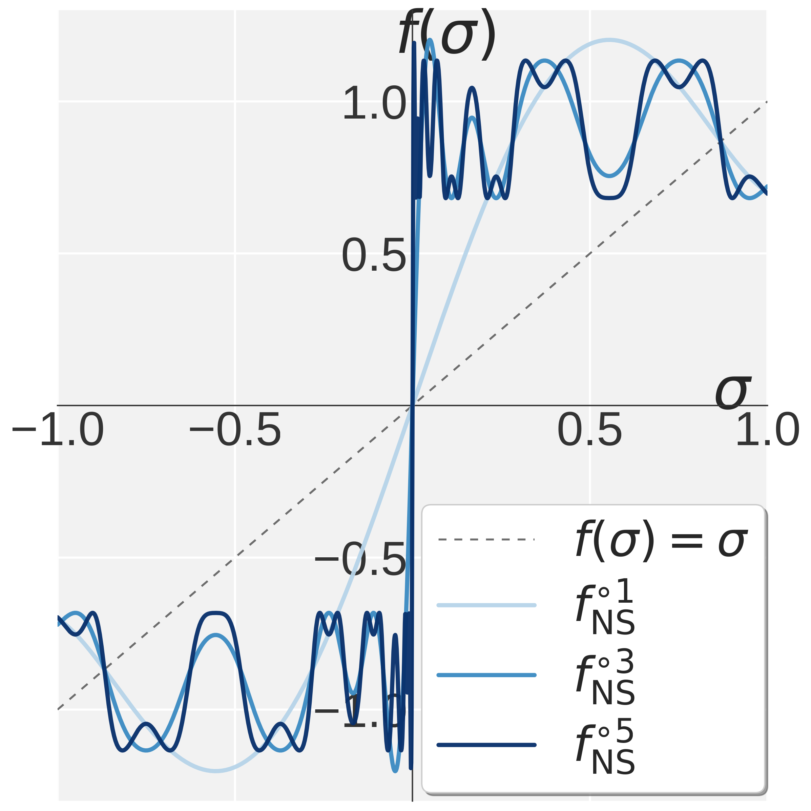
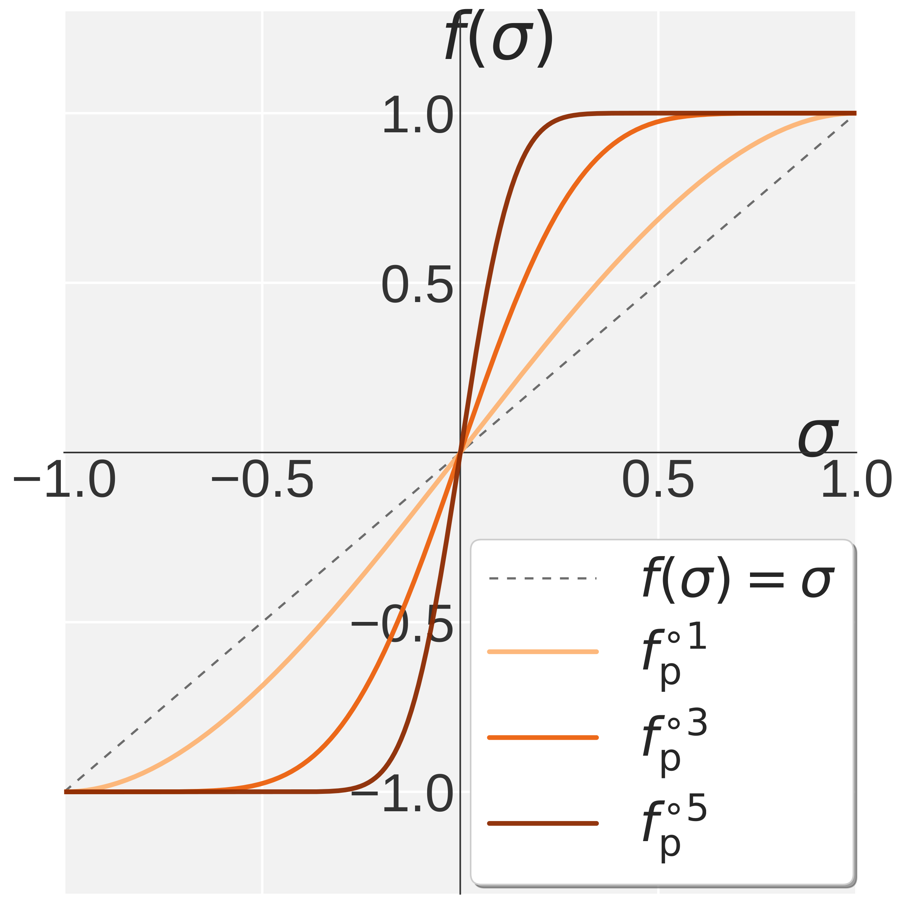
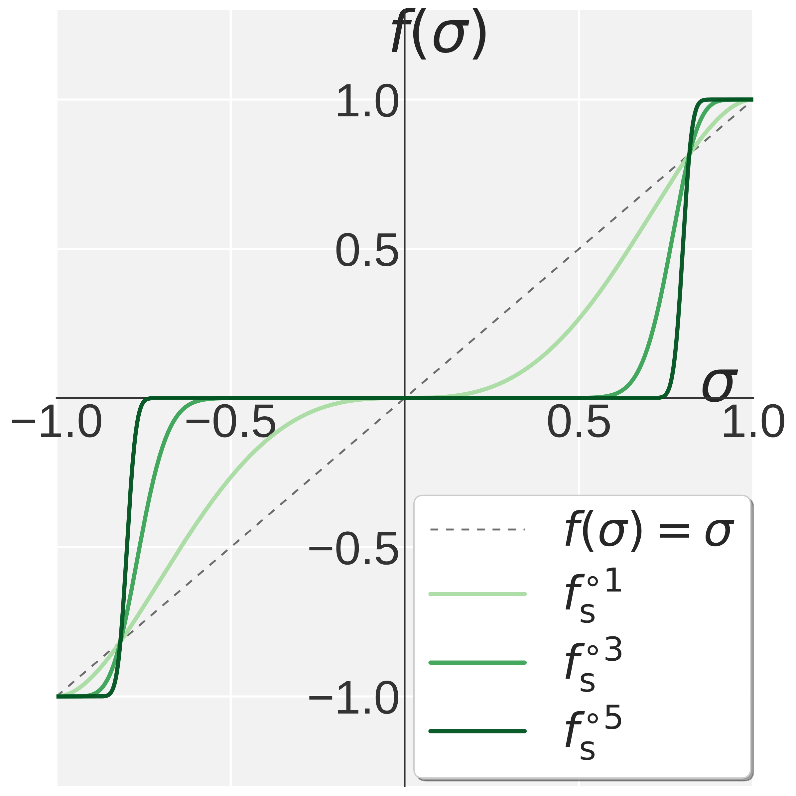
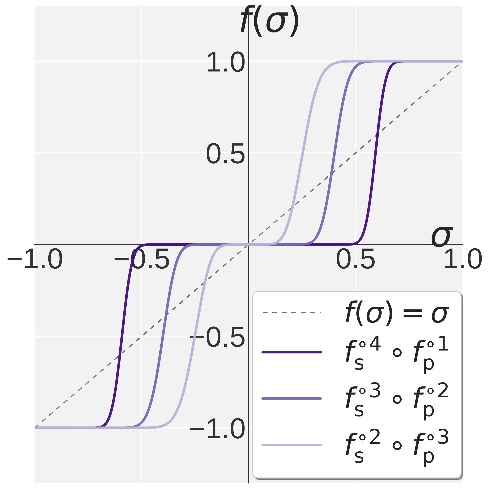

<div align='center'>

# Rethinking Muon Beyond Pretraining: Spectral Failures and High-Pass Remedies for VLA and RLVR

[](https://arxiv.org/abs/2605.19282)
[](https://chongyu-fan.netlify.app/posts/pion/)
[](https://github.com/OPTML-Group/Pion/issues)

[](LICENSE)
[](https://pytorch.org/)
[](https://paperswithcode.co/benchmark/libero-object?task=robotics&eval=14126)
</div>

<p align="center">
  <b>Chongyu Fan</b><sup>†</sup> &nbsp;
  Gaowen Liu<sup>‡</sup> &nbsp;
  Mingyi Hong<sup>¶</sup> &nbsp;
  Ramana Rao Kompella<sup>‡</sup> &nbsp;
  Sijia Liu<sup>†,§</sup>
</p>

<p align="center">
  <sup>†</sup>Michigan State University &nbsp;&nbsp;
  <sup>‡</sup>Cisco &nbsp;&nbsp;
  <sup>¶</sup>University of Minnesota &nbsp;&nbsp;
  <sup>§</sup>IBM Research
</p>

---

This is the official code repository for the paper [**"Rethinking Muon
Beyond Pretraining: Spectral Failures and High-Pass Remedies for VLA and
RLVR"**](https://arxiv.org/abs/2605.19282), which introduces **Pion**
(s**P**ectral h**I**gh-pass **O**ptimization on mome**N**tum) -- a
drop-in replacement for Muon designed for regimes such
as **vision-language-action** (VLA) training and **reinforcement
learning with verifiable rewards** (RLVR). See the
[project page](https://chongyu-fan.netlify.app/posts/pion/) for more.

<table align="center" width="100%">
  <tr>
    <td align="center" width="25%"></td>
    <td align="center" width="25%"></td>
    <td align="center" width="25%"></td>
    <td align="center" width="25%"></td>
  </tr>
  <tr>
    <td align="center"><sub>(a) Muon NS</sub></td>
    <td align="center"><sub>(b) Promotion <i>f</i><sub>p</sub></sub></td>
    <td align="center"><sub>(c) Suppression <i>f</i><sub>s</sub></sub></td>
    <td align="center"><sub>(d) High-pass NS</sub></td>
  </tr>
</table>

<p align="center">
  <em>Visualization of <code>f(&sigma;)</code> over
  <code>&sigma; &in; [0, 1]</code>, with <code>f(&sigma;) = &sigma;</code>
  shown as the identity reference.
  <b>(a)</b> <code>f<sup>t</sup><sub>NS</sub></code> denotes Muon's NS
  iteration applied <code>t</code> times.
  <b>(b)</b> <code>f<sup>t</sup><sub>p</sub></code> denotes the Promotion
  polynomial <code>f<sub>p</sub></code> applied <code>t</code> times.
  <b>(c)</b> <code>f<sup>t</sup><sub>s</sub></code> denotes the Suppression
  polynomial <code>f<sub>s</sub></code> applied <code>t</code> times.
  <b>(d)</b> Pion's high-pass NS iteration:
  <code>f<sup>k<sub>s</sub></sup><sub>s</sub> &compfn;
  f<sup>k<sub>p</sub></sup><sub>p</sub></code> applies
  <code>k<sub>p</sub></code> Promotion steps followed by
  <code>k<sub>s</sub> = 5 - k<sub>p</sub></code> Suppression steps.</em>
</p>

## Abstract

Muon (**M**oment**U**m **O**rthogonalized by **N**ewton–**S**chulz) is a
matrix-aware optimizer that leverages Newton–Schulz (NS) iterations to
enforce spectral gradient orthogonalization by driving all singular values
of the momentum matrix toward 1. While this *uniform spectral whitening*
enhances exploration and outperforms AdamW in LLM pretraining, we show it
could lead to fundamental limitations beyond pretraining in two increasingly
important regimes: **(i)** cross-modality *vision-language-action* (VLA)
training, where inherently low-rank action-module gradients cause
amplification of noisy tail directions, and **(ii)** *reinforcement learning
with verifiable rewards* (RLVR), where low-SNR gradients and the need to
preserve per-head specialization inherited from prior training make
whitening unstable. To address these challenges, we propose **Pion** (s**P**ectral h**I**gh-pass
**O**ptimization on mome**N**tum), a drop-in replacement for Muon that
preserves its computational efficiency while replacing uniform spectral
whitening with a two-stage *Promotion + Suppression* mechanism, which we
call the *high-pass NS* iteration. This design induces a sharp spectral
high-pass effect, anchoring dominant singular values at 1 while suppressing
noisy tail components toward 0, with controllable filter strength. To preserve pretrained per-head heterogeneity, Pion also supports a
*per-head* mode that applies updates independently across attention heads
via a simple reshape, at no extra cost. Extensive experiments demonstrate
consistent gains over Muon and AdamW across both VLA and RLVR regimes. In
VLA training on LIBERO and LIBERO-Plus, Pion consistently outperforms both
baselines across ℓ<sub>1</sub>-regression (VLA-Adapter) and flow-matching
(VLANeXt) architectures, *e.g.*, reaching **100%** success rate on LIBERO
Object at training 1,500 steps with VLA-Adapter, vs. 97.0% for Muon and
only 32.2% for AdamW. In RLVR post-training on Qwen3-1.7B/4B with GRPO and
GMPO, Pion also outperforms AdamW on MATH and GSM8K while Muon collapses to
zero.

## What's in this repo

```
Pion/
├── VLA/                       # Vision-Language-Action experiments
│   ├── VLAAdapter/            # VLA-Adapter
│   │   └── pion_optim/        # Muon / DefaultPion / LowRankMuon
│   ├── VLANeXt/               # VLANeXt
│   │   └── pion_optim/        # Muon / DefaultPion
│   └── openpi/                # π0.5 on real Franka FR3
│       └── src/openpi/training/muon_optim.py
│                              # MuonAdamW / DefaultPionAdamW
└── RL/                        # RLVR experiments
    └── verl/                  # GRPO + GMPO on Qwen3-1.7B / 4B, GSM8K + MATH
        └── verl/utils/muon.py
                               # MuonAdamW / DefaultPionAdamW / PerHeadMuonAdamW / PerHeadPionAdamW
```

Across all sub-repos we maintain the **same five optimizer families**,
each paired into a **base** form and an **AdamW-fused** form. Which form
a sub-repo ships depends on whether its training framework can hold
**multiple** `torch.optim.Optimizer` instances at once:

* `VLA-Adapter` / `VLANeXt` drive several optimizers in the same training
  loop (one Muon / Pion instance per modality bucket plus a
  `torch.optim.AdamW` for the 1-D / embedding / output-head bucket), so
  they ship the **base** classes and let the trainer call `step()` on
  each.
* `openpi` and `verl` are wrapped by frameworks (openpi's `Trainer`,
  verl's Hydra + FSDP2 config) that expose only a **single** optimizer
  slot per model; on those we ship the **AdamW-fused** variants, which
  apply the Muon / Pion polynomial to `ndim ≥ 2` parameters and AdamW to
  `ndim < 2` parameters inside one `step()` call.

Each sub-repo only ships the variants its recipes actually use (see the
tree above).

| Algorithm                                  | Base class      | AdamW-fused class      |
| ------------------------------------------ | --------------- | ---------------------- |
| Muon (NS on the whole matrix)              | `Muon`          | `MuonAdamW`            |
| Muon (NS on per attention head)            | —               | `PerHeadMuonAdamW`     |
| Pion (high-pass NS on the whole matrix)    | `DefaultPion`   | `DefaultPionAdamW`     |
| Pion (high-pass NS on per attention head)  | —               | `PerHeadPionAdamW`     |
| LowRankMuon                                | `LowRankMuon`   | —                      |

Each sub-repo is a pruned, vendored copy of an upstream training
codebase with the Pion optimizer wired in and three drop-in run scripts
(`run_adamw.sh`, `run_muon.sh`, `run_pion.sh`). See each sub-repo's
`README.md` for full environment setup, data preparation and run
commands.


## Getting Started

The optimizers are not packaged as a top-level library; they live next
to the training code that uses them. Pick your task and follow the
sub-repo README:

| Sub-repo                                           | Backbone / task                                              |
| -------------------------------------------------- | ------------------------------------------------------------ |
| [`VLA/VLAAdapter`](VLA/VLAAdapter/README.md)       | VLA-Adapter                                                  |
| [`VLA/VLANeXt`](VLA/VLANeXt/README.md)             | VLANeXt                                                      |
| [`VLA/openpi`](VLA/openpi/README.md)               | π<sub>0.5</sub> on Franka FR3                                |
| [`RL/verl`](RL/verl/README.md)                     | GRPO / GMPO on Qwen3-1.7B / 4B with GSM8K + MATH             |

Inside each sub-repo:

* `pion_optim/` (for `VLA-Adapter` / `VLANeXt`) or
  `*/utils/muon.py` / `*/training/muon_optim.py`
  (for `verl` / `openpi`) contains the optimizer implementations.
* `scripts/run_adamw.sh`, `scripts/run_muon.sh`, `scripts/run_pion.sh`
  are the three drop-in launchers.


## Citation

If you find this work useful, please consider citing:

```bibtex
@article{fan2026rethinking,
  title={Rethinking Muon Beyond Pretraining: Spectral Failures and High-Pass Remedies for VLA and RLVR},
  author={Fan, Chongyu and Liu, Gaowen and Hong, Mingyi and Kompella, Ramana Rao and Liu, Sijia},
  journal={arXiv preprint arXiv:2605.19282},
  year={2026}
}
```

## Acknowledgements

This codebase builds on the excellent
[Muon optimizer](https://github.com/KellerJordan/Muon),
[Flash-Muon](https://github.com/nil0x9/flash-muon),
[VLA-Adapter](https://github.com/OpenHelix-Team/VLA-Adapter),
[VLANeXt](https://github.com/DravenALG/VLANeXt),
[openpi](https://github.com/Physical-Intelligence/openpi), and
[verl](https://github.com/verl-project/verl).

## Contributors

* [Chongyu Fan](https://a-f1.github.io/)
